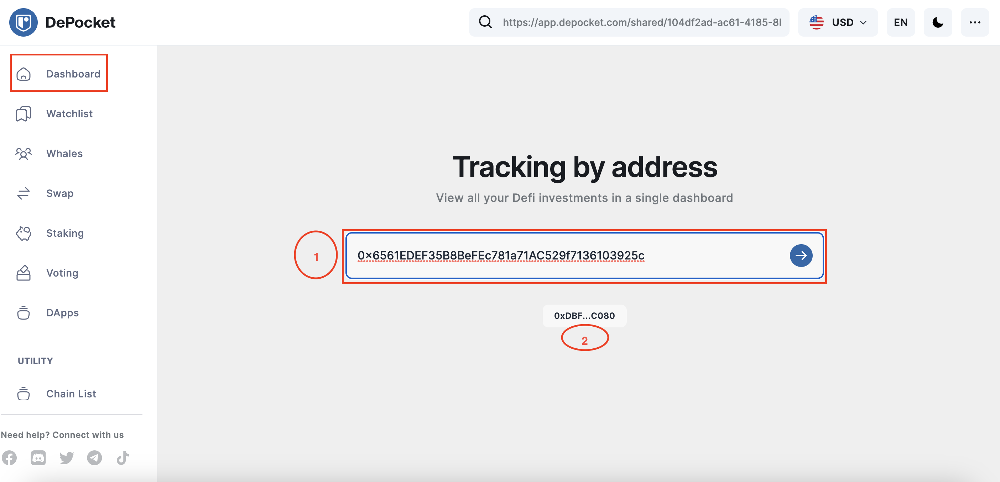
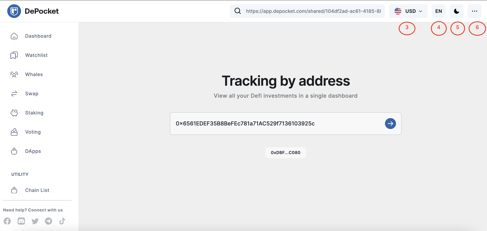
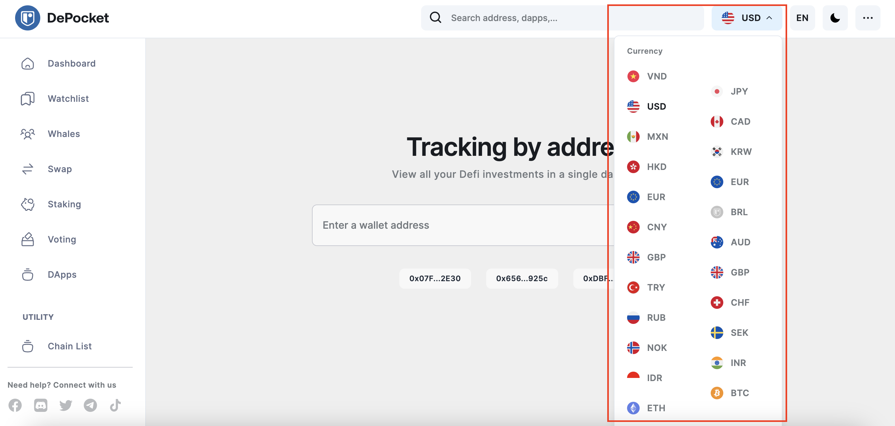
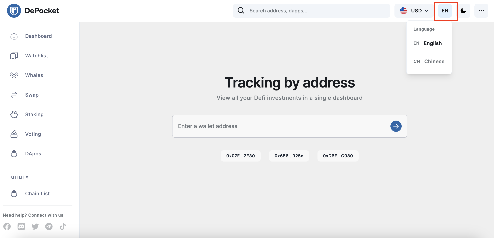
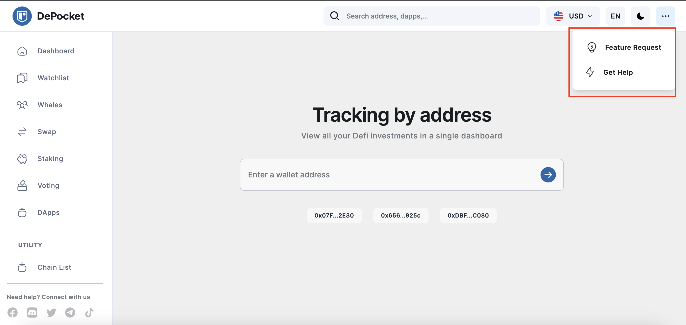
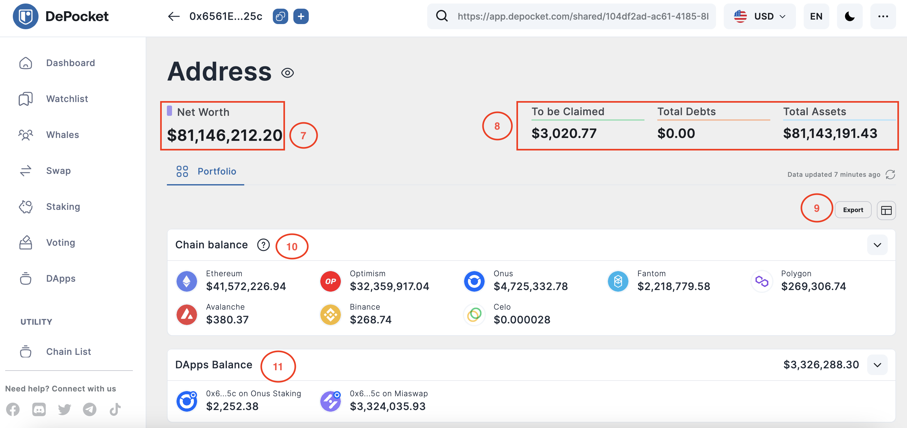
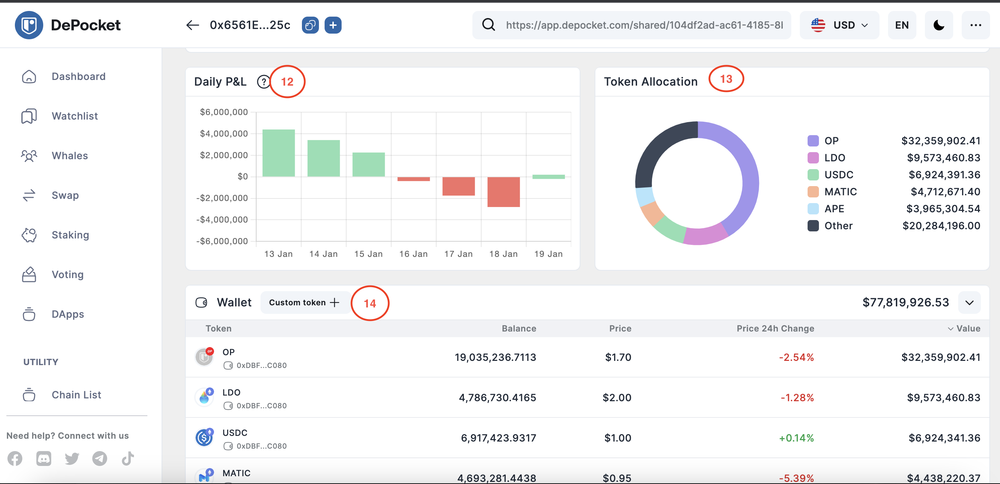

# How to view your wallet portfolio?

### 🚀 DePocket App - Track Balances Without Connecting A Wallet

In this article, we’ll discuss how investors can benefit from using DePocket App's dashboard. Using this dashboard effectively will significantly help investors save time while enjoying the experience of crypto trading.

When investors first access the **DePocket App** via [**app.depocket.com**](https://app.depocket.com/), the image below will display. 

1) Investors will find a `search bar`in the center of the dashboard allowing them to enter any wallet address they’re wanting to track the balances of. 

2) Located below the `main search bar`, is an example of the wallet assets that will appear.

3) Investors can choose from up to 13 different currencies. More to be added in the future.

4) Investors can also choose between English or Chinese, with more languages to be added in the future.

5) Dark mode can also be selected.

6) Next, investors can also lodge requests or contact the support team for additional help.

After a wallet address has been entered into the main search bar, you will be taken to a results display page as depicted below.

7) The value depicted here reveals the Net Worth Balance of the wallet being tracked.

8) In this section, investors will see the wallet’s balance to be claimed, along with the Total Debts amount, and the Total Assets value.

9) Investors can also export the wallet’s data as a CSV file.

10) Here, the aggregated balance data for the wallet is shown, with details of each chain.

11) In this section, investors can view the aggregated balance data for the chosen wallet, with details of any associated dApp.

12) Investors can also view the profit and loss amounts based on their current token and position holdings, converted to USD.

13) This chart depicts the token allocations for the chosen wallet being tracked.

14) Here, investors can add the token they want to personally track.

15) Lastly, investors can choose to display tokens with a total balance that is < 1%, or click `show all` to see the full list.

That concludes the basic overview of the DePocket dashboard. If you’re wanting to learn more about this incredibly user-friendly tracking & trading App click the link below to read more.