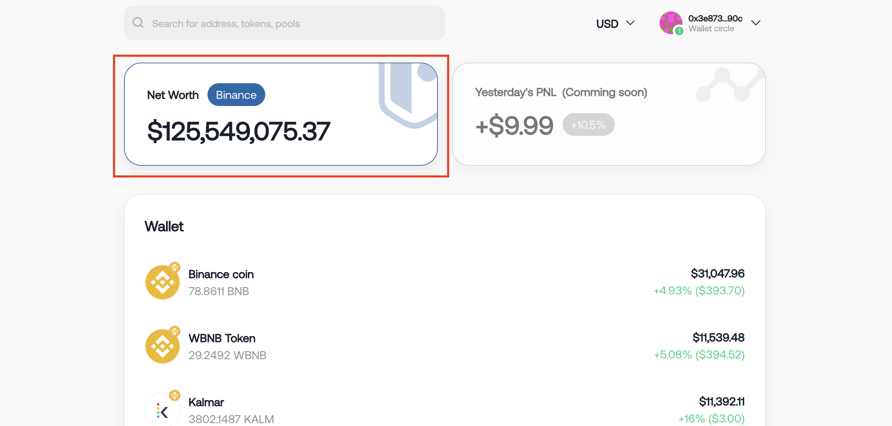

# Introduction

You can view the dashboard immediately after connecting the wallet or track a specific address. "**Dashboard**" is the main component of DePocket. It is designed to be simple and easy to understand with the following main functions:

* [Shows the "**Net Worth**" of all your wallets. ](#net-worth)
* [List all assets in your wallet](#list-all-assets-in-your-wallet)
* [List all assets locked in DeFi protocols](#list-all-assets-locked-in-defi-protocols)
* [Manage wallet addresses](#manage-wallet-addresses)
* [Other utilities](#other-utilities)

Or [**Click here**](https://app.depocket.com/addresses/0x3e8734Ec146C981E3eD1f6b582D447DDE701d90c) to see the demo pocket.

### Net Worth

Net worth is the cumulative sum of funds in all wallets. Values will be converted to real-time prices.&#x20;

`DePocket supports viewing multiple wallets at once.`

### List all assets in your wallet

`DePocket supports tracking over 1500 tokens on the Binance Smart Chain.`

.png>)

### List all assets locked in DeFi protocols

`Currently supports [PancakeSwap](https://pancakeswap.finance/) and [Venus](https://app.venus.io/). We are working hard to quickly bring support for many other protocols.`

.png>)

.png>)

### Manage wallet addresses

You can add multiple wallet addresses, add or delete any address easily.

### Other utilities

DePocket also has other utilities as follows to make it the most convenient for users to use:

* Select currency
* Dark mode
* Change language
* Search for specific address

