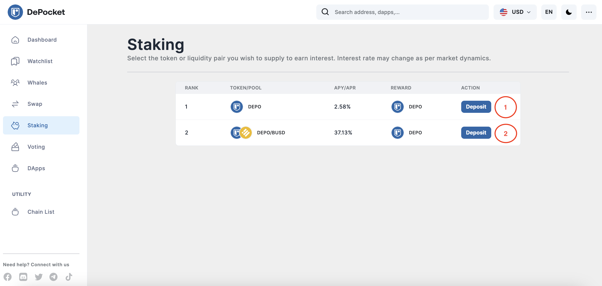
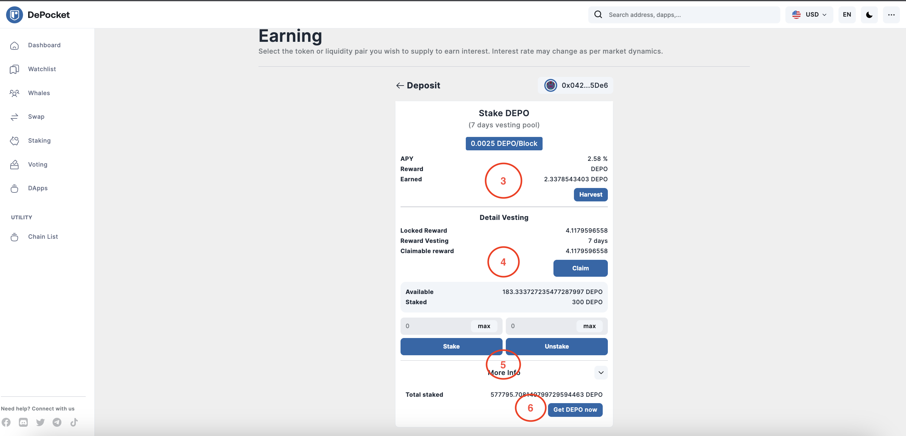

# How to stake DEPO token?

### 🚀 Staking DEPO Earns More Profit with DePocket

How does staking DEPO make you rich when combined with the strength of compound interest? Well, there are three reasons to explain why embarking on your staking journey with DePocket staking pools can be extremely profitable:

- DEPO staking is much safer than farming because it can prevent impermanent loss and slippage.
- The more people staking, the more liquidity, resulting in investors avoiding impermanent loss with slippage when staking DEPO/BUSD. It also increases decentralization to help avoid hacker attacks, improving the general security for DEPO staking and DEPO/BUSD
- As more investors stake, the percentage of profits will reduce to avoid inflation.

Let’s have a look at how you can stake DEPO step by step.

*When you visit the staking feature, just select the token or liquidity pair you wish to supply in order to earn interest. Interest rates may change according to market dynamics*

1) Stake DEPO in a 7-day vesting pool.

2) Stake DEPO/BUSD in a 180-day vesting pool.

Check the APY/APR here.

*When you click to deposit DEPO, the display will appear as the picture*

3) Investors can Harvest and also clear all the information here.

4) After choosing a 7-day DEPO stake, the rewards can be claimed here.

5) Investors can also type the amount they want to stake on the left side. However, on the right side, DEPO can be unstaked before the timeline, but remember, if you do that, you cannot claim the rewards and will still incur the cost of any gas fees.

6) If you want to buy more DEPO, please click on the button `Get DEPO now`! This will take investors to PancakeSwap where they can buy more DEPO.

*When you click to deposit DEPO/BUSD, your screen will display the information as depicted on the image above*

7) When staking DEPO/BUSD, investors will have to stake for 180 days. The app will show you how many DEPO/BUSD is available to be staked - once completed, just click the `Approve Contract` button.

In the coming future, DePocket will integrate several additional investment features that include farming or staking on multiple platforms. With its extremely user-friendly interface, investors can easily choose the platform they want, and the platform with the highest APY/APR, all in just a few simple clicks. 

So, stake your DEPO today and start making more profit! 