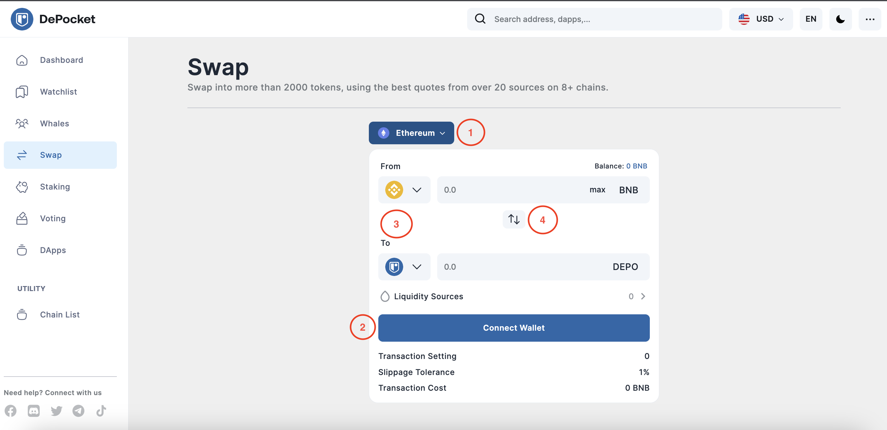
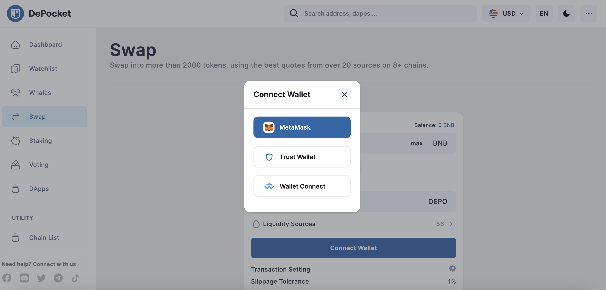
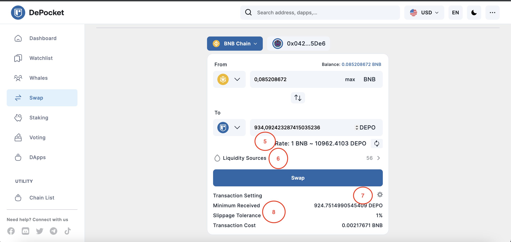
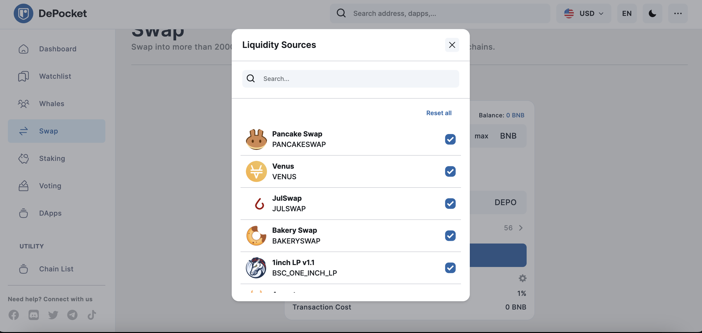
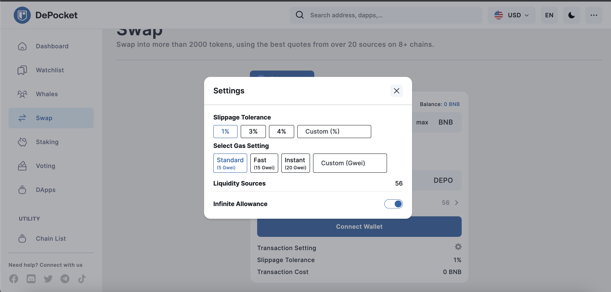

# Swap token on multi chains

### 🚀 Swap with DePocket and save time

As more and more people move away from traditional banking, the need for digital asset exchanges has skyrocketed. But with so many options available, it can be tough to figure out which one is best for you.

Enter DePocket – the ultimate digital asset exchange! With DePocket, you can easily find the best exchange rates for all of your Defi assets. Plus, you can save money on gas fees by finding the cheapest exchanges available.

Let's go through it step by step!

*After clicking the `Swap` button, Investors can see the display as shown in the picture above*

1) Here you can choose the chain you want to perform a swap with.

2) Make sure you connect your wallet before swapping any pair of tokens.

*DePocket currently supports investors who want to connect a MetaMask and Trust Wallet. DePocket will integrate more options in the future.*

3) You can choose any pair of tokens you want to swap.

4) Users can switch between the pair of tokens.

*After connecting your wallet, the display will appear as depicted in the picture.*

5) Here investors can check the rate.

6) You can also check liquidity sources. DePocket uses the `DEX Aggregator` feature, which uses financial protocols that provide traders, or investors, with easy access to various trading pools. However, you can click on the arrow and choose the desired number of liquidity sources.

7) Here investors can adjust the transaction settings like `Slippage Tolerance`, `gas settings`, `etc`.

8) You can also check the ​​Minimum Received, Slippage Tolerance, or Transaction Costs before making the decision to complete the swap.

So why wait? Connect your wallets today and start swapping your assets like a pro!