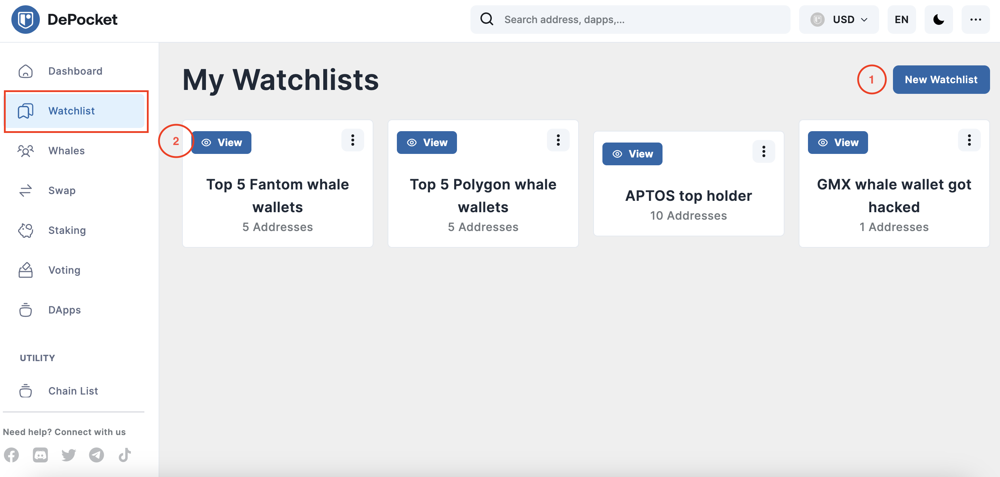
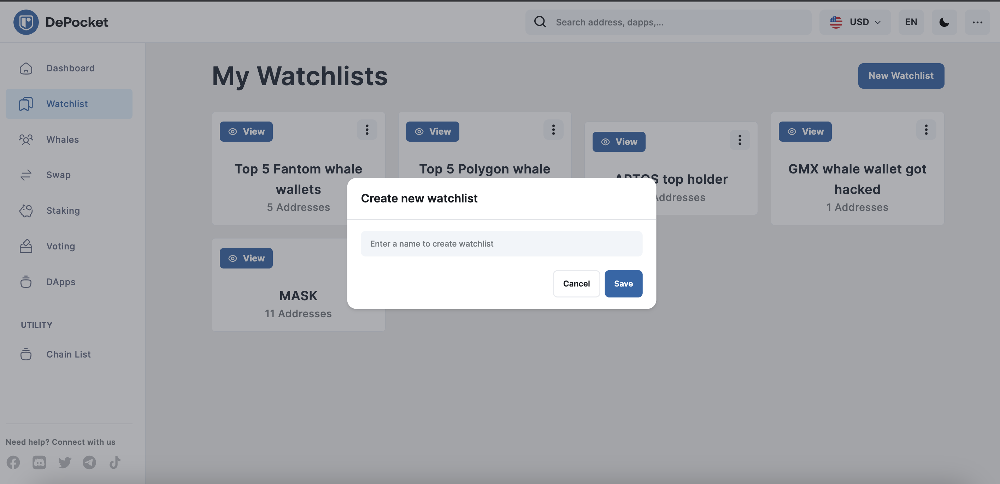
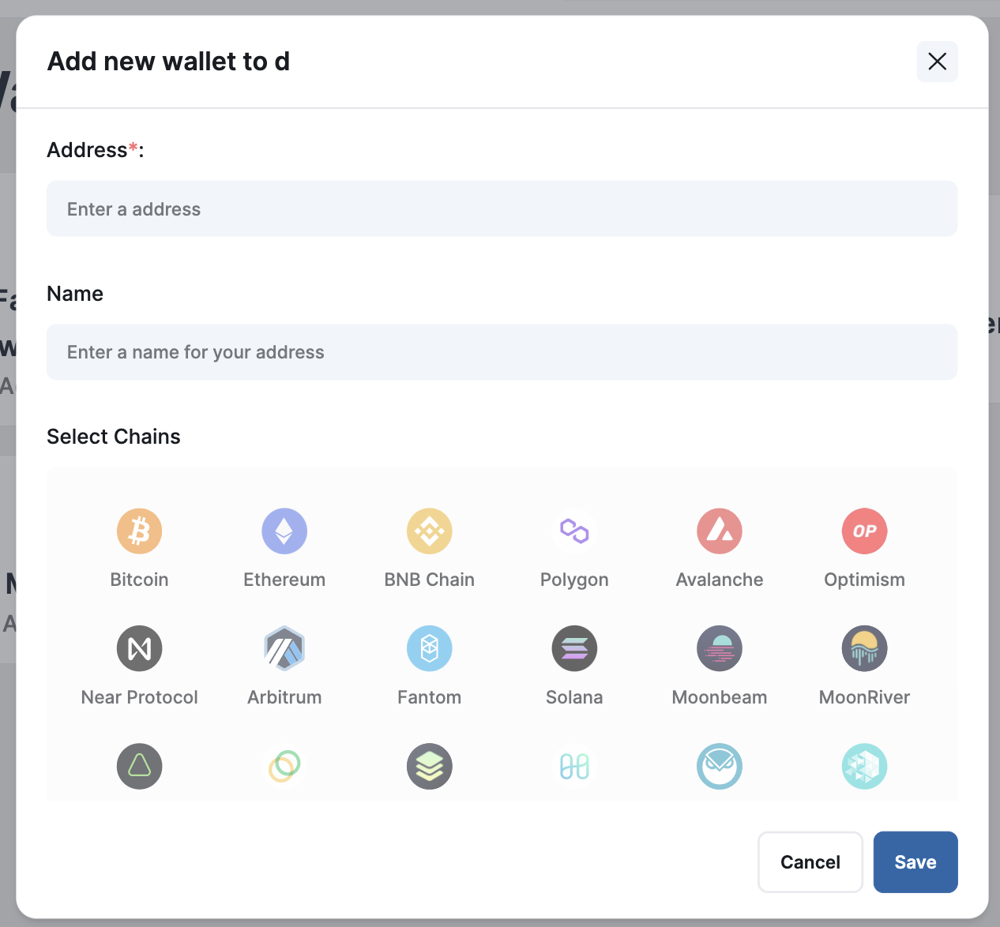
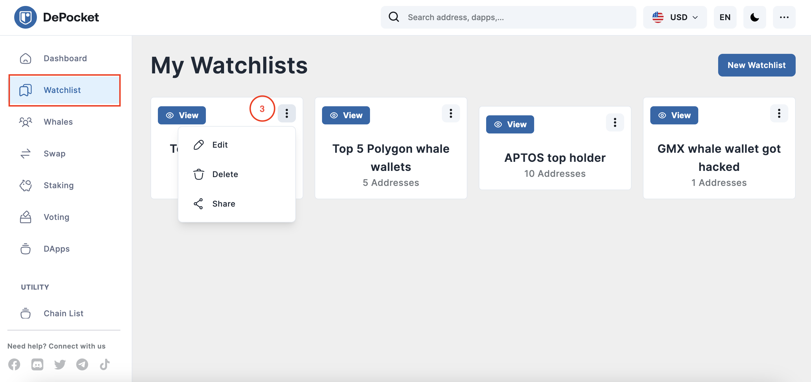
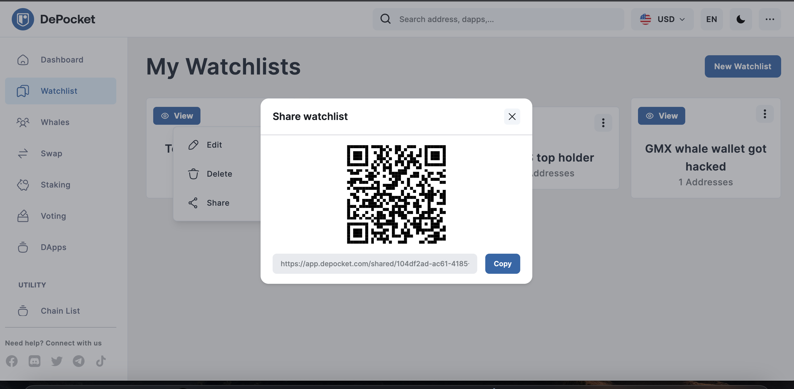
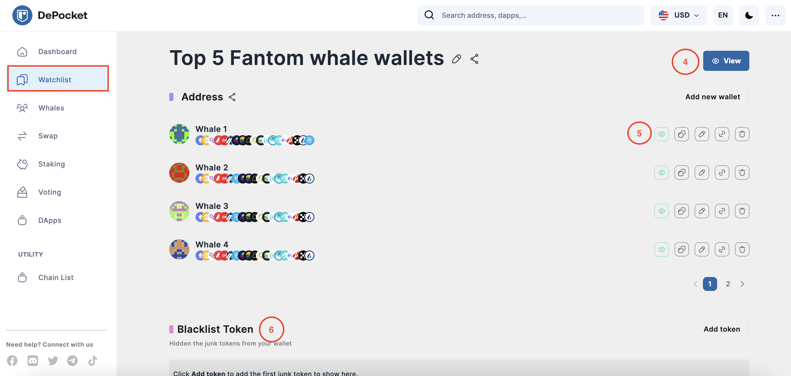
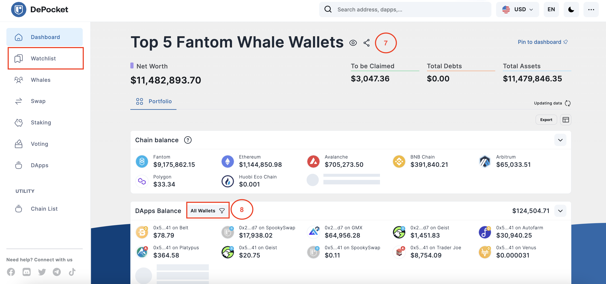
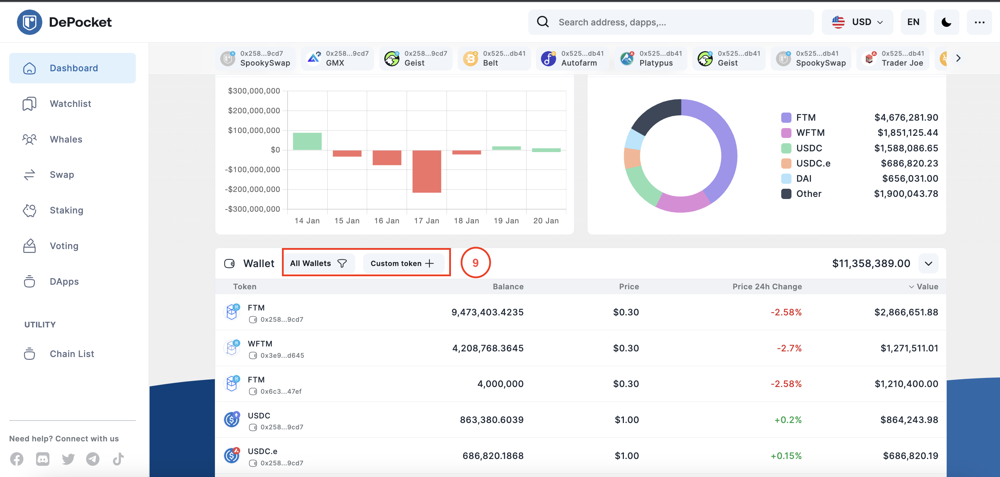

# Create a watchlist

**DePocket’s App** provides a unique watchlist feature, which is really helpful for investors who want to follow specific wallets and monitor their trading activities. For example, investors can track the P&L of many wallets at the same time, or follow the big whales who significantly affect the market. All of this helps the smart investor make the right investment decisions.  

In this article, we will guide you on how to use this feature step by step in order to save you some time.

1) Create a new watchlist yourself simply by typing the name of the watchlist, custom wallet’s name and add the wallet address. You can add many wallets into one watchlist.

2) Once the watchlist has been created, it will appear on the dashboard as depicted in the image below. 

3) On the right side of your watchlist, click the three menu dots for a drop-menu to appear. This will allow you options to Edit, Delete, or Share your watchlist, again as depicted in the image below.

*When you choose to share your watchlist, you can either copy the link provided, or simply share the QR code provided. Users with their DePocket Mobile App can open and view your watchlist, while you can also save this watchlist to your own mobile app in the same manner*

4) While on the main `watchlist` page, users click the `view` button in the upper right corner to see all of the wallet addresses.

5) As depicted in the image below, clicking on the `eye` icon allows you to choose which wallet you want to view at any given time. In the icons next to this, users can also copy the wallet address, share the link, or delete the wallet.

6) Towards the bottom, DePocket has added a `Blacklist` feature that allows you to hide the tokens you don’t want visible.

7) When you view the watchlist, the dashboard will appear in a similar way to when you track the balances of a single wallet, as depicted below.

8) Here you can filter the wallet you want to track, while not having to track all of the wallets in the watchlist.

9) It is the same for the token area. You can add the token you want to monitor, and filter the wallet you want to track.

We hope you will enjoy using the DePocket App as much as our investors have. 
Get into DePocket today!
