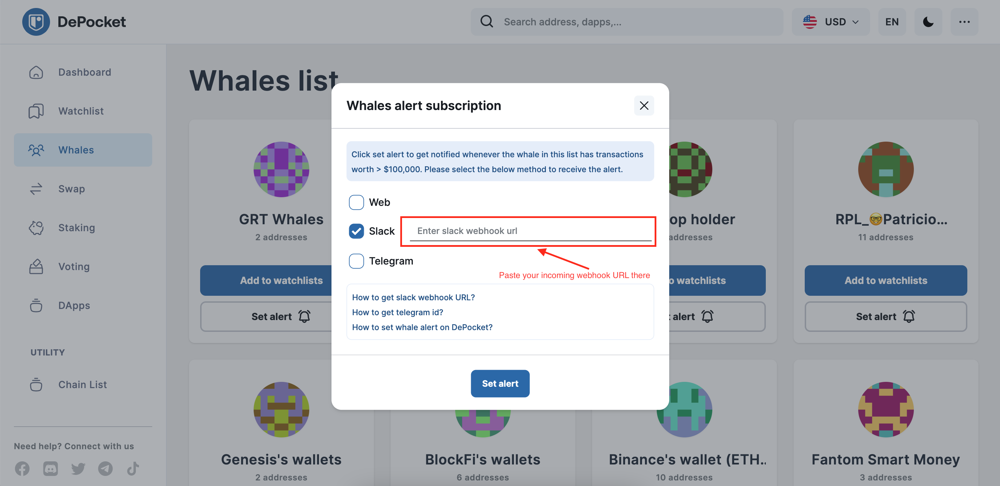

# How to get slack webhook URL?

```
To setup the whales alert with Slack on DePocket, you have to get the Slack webhook URL to add there. Let follow this guide to get one.
```

## Setup incoming webhook on Slack
Please follow this guide by Slack team: [Incoming webhooks for Slack](https://slack.com/help/articles/115005265063-Incoming-webhooks-for-Slack)
In the **Step 5** in the guide above. Let copy your `Incoming webhooks URL`
## Setup on DePocket
After Slack option was selected, the field below will appear to you.

Paste your link to the field below.