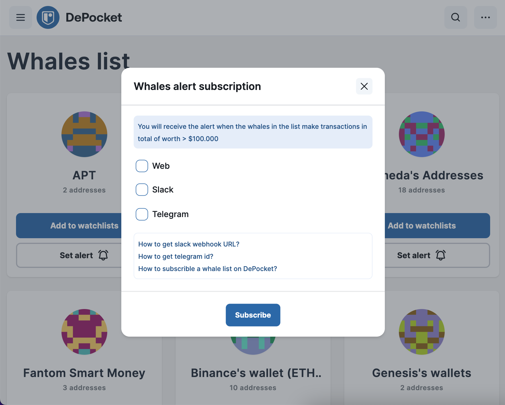

# How to get Telegram ID?

```
To setup the whales alert with Telegram on DePocket, you have to get the Telegram ID to add there. Let follow this guide to get one.
```

## Setup DePocket Bot.
Let start with this bot: [DePocketBot](https://t.me/depocketbot)

After you click to the [DePocketBot](https://t.me/depocketbot). You will see the screen as below.

And then, click to `Start` button. You will received message as below.

Please copy the ID in your message and next to the [Setup on DePocket](#Setup_on_DePocket)

## Setup on DePocket
After Telegram option was selected, the field below will appear to you.



Paste your ID to the field above and click `Set alert`.
After that, the `Success to set alert` notify will appear when you success to set the alert for this whale list.