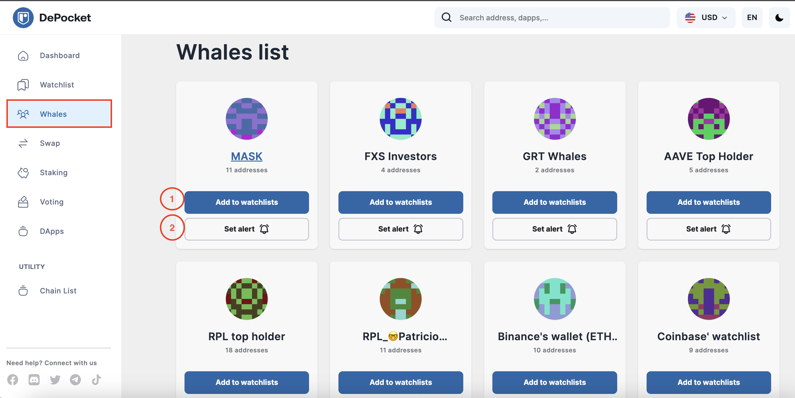
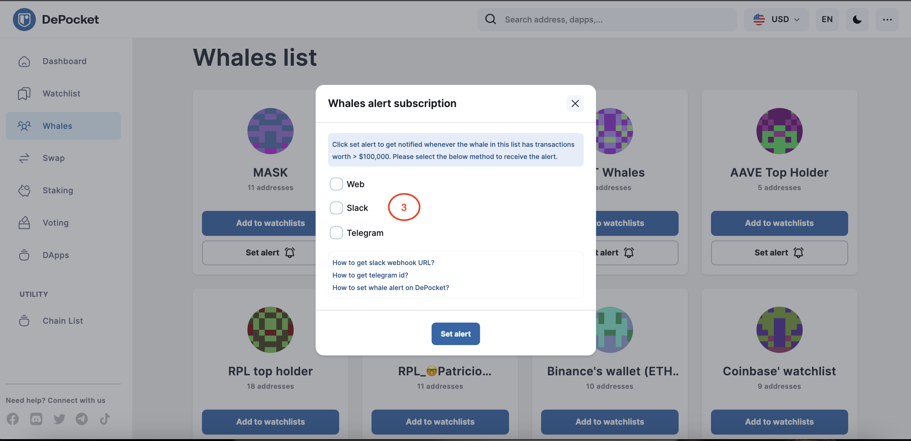
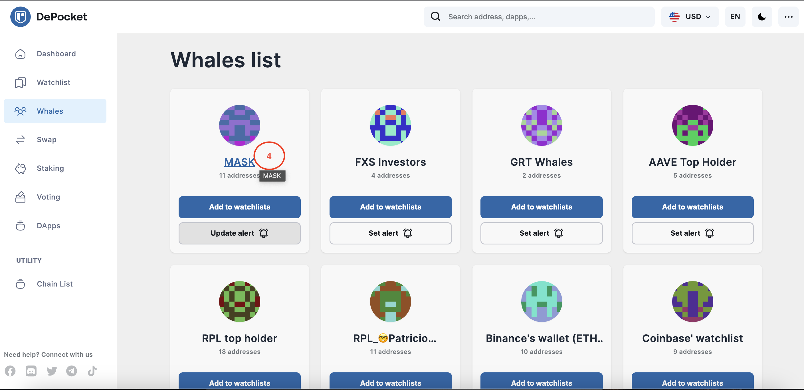
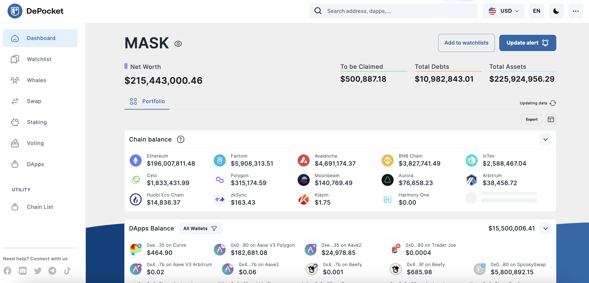

# Subscribe a whalelist

### 🚀 Follow whale wallets more easily with DePocket

A smart investor knows how to track whale wallets, and the importance of monitoring their activities. By tracking specific wallets, investors can understand the movements of large investments, and where the money is flowing. We’re talking about the wallets of big investors who have the potential to affect the overall price of a coin or token you might hold, and thereby making it easier to make the best investment decision.

While investors can hunt whale wallets themselves, it will take a lot of time and effort. DePocket solves this issue by providing a specifically built function that does the hard work for you.

Let's go through it step by step and see how it works.

1) Firstly, as depicted below, investors can add any whale list already provided, to their own watchlist.

2) Next, click on the `Set alert` feature to get notified whenever the whale in this list completes a transaction in excess of $100,000.

3) Investors can also choose how and where the notification is sent; whether to a Browser, Slack or Telegram account, for example. 

4) Additionally, investors can click on the name of the Whales list to check all available details.

*The whale dashboard is designed in the same manner as the watchlist dashboard, making it instantly recognisable*

Click this link to view the details:

Be a smart investor and follow the Whales with DePocket!

Get into DePocket today! 

